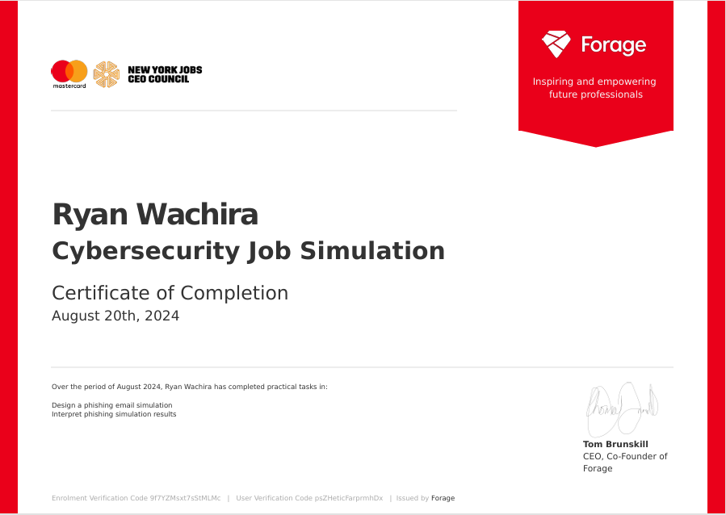

# MasterCard Cybersecurity Virtual Internship

## Overview
During the MasterCard Cybersecurity Virtual Internship, I worked as an analyst within the Security Awareness Team. This program provided hands-on experience in creating and executing cybersecurity initiatives, with a particular focus on phishing prevention and employee training. Below is a summary of the key projects I completed during the internship.

## Projects

### 1. Phishing Email Simulation
**Objective**: To design a realistic phishing email aimed at testing employees' awareness and ability to identify phishing threats.

**Description**: I developed a phishing simulation email that mimicked common tactics used by cybercriminals. The email was designed to appear legitimate while enticing employees to click on a malicious link. The purpose was to assess the vulnerability of different departments within the organization.

**Skills Gained**: Phishing Simulation Design, Communication, Attention to Detail

### 2. Phishing Simulation Results Analysis
**Objective**: To analyze the results of the phishing simulation and identify which departments were most vulnerable.

**Description**: Using data from the phishing simulation, I identified high-risk groups and provided insights into employee behaviors. This analysis was critical in determining which teams required additional training to reduce the risk of successful phishing attacks.

**Skills Gained**: Data Analysis, Risk Assessment, Problem-Solving

### 3. Cybersecurity Awareness Training
**Objective**: To design and implement targeted cybersecurity training for the departments most susceptible to phishing attacks.

**Description**: I created a concise and engaging training presentation aimed at educating employees on how to identify phishing emails and avoid common traps. The training focused on practical tips and real-world examples to make the content relatable and actionable.

**Skills Gained**: Training Development, Cybersecurity Awareness, Presentation Design

## Key Skills Developed
- Phishing Simulation Design
- Cybersecurity Awareness Training
- Data Analysis
- Security Risk Mitigation
- Communication and Report Writing
- Problem-Solving

## Certification
I successfully completed the MasterCard Cybersecurity Virtual Internship. You can view my certificate below:

